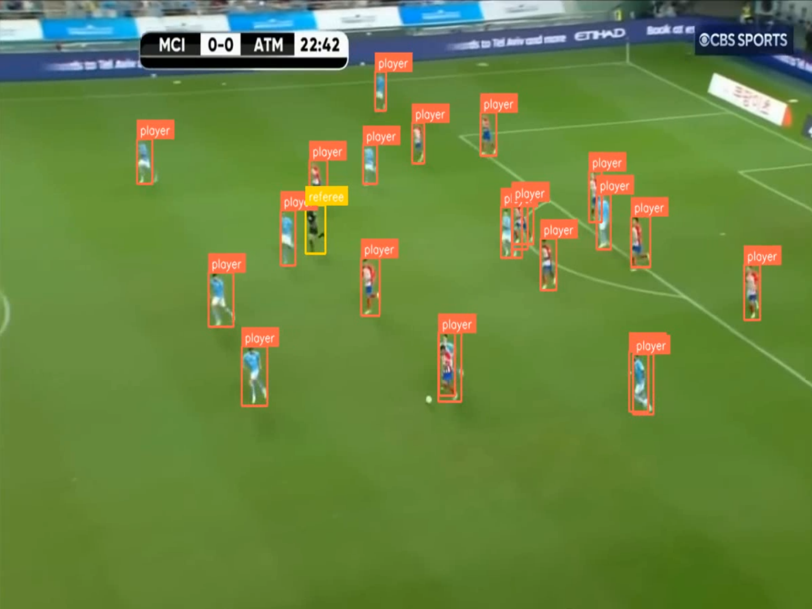

# Football Players Detection Model

## Overview

This repository contains a model for detecting football players in video footage. It leverages YOLOv8 for object detection, with various models trained and fine-tuned for detecting players on the football field. The project includes tools for both live and static video predictions, training models, and testing with sample videos.

## Dataset

The models were trained using the [Football Players Detection dataset](https://universe.roboflow.com/roboflow-jvuqo/football-players-detection-3zvbc) from Roboflow. This dataset contains annotated images of football players, which are used to train and evaluate the models.

## Models

### 1. `yolov8n_transfer_based_model`

- **Description**: A YOLOv8 model trained with transfer learning where the first 10 layers are frozen. This model was trained based on basic YOLOv8n model.
- **Location**: `models/yolov8n_transfer_based_model.pt`

### 2. `yolov8n_transfer_road_model`

- **Description**: A YOLOv8 model trained with transfer learning where the first 10 layers are frozen. This model was trained based on fine-tuned YOLOv8n model for road object detection purposses.
- **Location**: `models/yolov8n_transfer_road_model.pt`

## Usage

### Live Prediction

To perform live object detection using a webcam or static video file, use the `live.py` script. The script allows you to choose between live webcam feed or a static video file for predictions.

**Example Usage:**

```bash
python live.py
```

## Training

To train the model, use the train.py script. This script includes functions to train YOLOv8 models using the provided dataset.
```bash
python train.py
```

## Testing

To test the models, use the Jupyter notebooks available in the notebooks directory.

## Example

Here is an example of a predicted image with annotations:


## Directory Structure
```bash
.
├── football_players_detection_model
│   ├── github_photos
│   │   └── example.png
│   ├── __init__.py
│   ├── live.py
│   ├── models
│   │   ├── fine_tuned_road_yolov8s.pt
│   │   ├── yolov8n.pt
│   │   ├── yolov8n_transfer_based_model.pt
│   │   └── yolov8n_transfer_road_model.pt
│   ├── notebooks
│   │   ├── testing.ipynb
│   │   └── yolov8n.pt
│   ├── res.mp4
│   ├── runs
│   │   ├── fine_tuning_freezed_model
│   │   │   ├── train
│   │   │   └── train2
│   │   └── fine_tuning_freezed_road_model
│   │       └── train
│   ├── test_videos
│   ├── train.py
│   └── yolov8n.pt
├── poetry.lock
├── pyproject.toml
├── README.md
└── tests
    └── __init__.py
```
